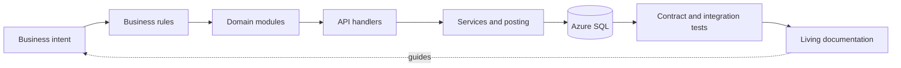

# Nest engineering knowledge base

## Purpose

This directory explains why Nest exists, how its financial workflows are implemented, and how to change it without weakening workspace isolation, ledger integrity, or user privacy.

Start with:

1. [Project and architecture overview](architecture/overview.md)
2. [Business rules](business/business-rules.md)
3. [Repository structure](architecture/repository-structure.md)
4. [Development guide](guides/development.md)
5. [API conventions](api/README.md)
6. [Database schema](database/schema.md)

AI coding assistants should begin with [AI project summary](ai/project-summary.md) and [AI pitfalls](ai/pitfalls.md).

## Scope

The knowledge base covers:

- Product intent and financial terminology.
- Next.js runtime, React client, route handlers, Prisma, and Azure SQL.
- Authentication, workspace authorization, financial posting, and idempotency.
- Every API route group and every Prisma model.
- Gmail, Azure OpenAI, Azure AI Search, market data, email, push, and scheduler integrations.
- Local development, testing, database operations, deployment, debugging, release gates, security, performance, and known debt.

It does not replace executable sources. When documentation conflicts with code:

| Concern | Authoritative source |
| --- | --- |
| Persisted shape and Prisma relations | `prisma/schema.prisma` plus deployed SQL migrations |
| HTTP behavior | `app/api/**/route.ts` |
| Generated API inventory | `generated/openapi.json` |
| Financial mutation semantics | `lib/posting-service.ts` and the calling domain route/service |
| Authentication and authorization | `lib/auth.ts`, `lib/workspace-auth.ts`, and route guards |
| Release gates | `package.json` and `.github/workflows/ci.yml` |
| Business intent | `guide.md`, verified against current implementation |

## How to use this knowledge base

### Before changing a feature

1. Locate the feature in [the feature map](ai/feature-map.md).
2. Read its module document and linked business rules.
3. Check its API group, database models, and tests.
4. Review [security invariants](architecture/security.md) and [common pitfalls](ai/pitfalls.md).
5. Run the validation gates in [the testing guide](guides/testing.md).

### When documentation is uncertain

Use the exact phrase **“Unknown from source code.”** Do not turn a plausible assumption into a project fact. Add a source link or an ADR when the uncertainty is resolved.

### Maintenance rules

- Update documentation in the same change as behavior, schema, configuration, or workflow changes.
- Prefer links to a canonical explanation over copying it into multiple files.
- Keep one topic per file and keep files below 800 lines where practical.
- Use repository-relative paths in prose and relative Markdown links between documents.
- Update `last_updated` and the “Last Updated” section for material changes.
- Add an ADR for decisions that constrain future implementation choices.

See [documentation standards](documentation-standards.md) for the page template.

## Knowledge map

The reusable Mermaid source is [traceability.mmd](diagrams/traceability.mmd).

## Related Files

- [`README.md`](../README.md)
- [`guide.md`](../guide.md)
- [`package.json`](../package.json)
- [`prisma/schema.prisma`](../prisma/schema.prisma)
- [`generated/openapi.json`](../generated/openapi.json)
- [Table of contents](SUMMARY.md)

## Dependencies

- Source code and configuration in the repository.
- Git history for migration and architectural context.
- Human review whenever intent cannot be proven from source.

## Assumptions

- The checked-out source and migrations describe the intended current release.
- Azure SQL is the production database because Prisma uses the `sqlserver` provider and production configuration validates SQL TLS.
- Vercel is the documented scheduler/deployment target because `vercel.json` and Vercel telemetry are checked in. Other supported production hosts are unknown from source code.

## Known Limitations

- The repository does not contain product analytics, service-level objectives, backup policies, incident history, or infrastructure-as-code for Azure SQL.
- API examples are illustrative; route handlers and generated OpenAPI remain authoritative.
- Business or regulatory requirements outside the source are unknown from source code.

## Future Improvements

- Add ownership metadata per domain.
- Publish coverage reports and browser-level end-to-end results.
- Add deployment infrastructure and disaster-recovery runbooks when those operational decisions are known.

## Last Updated

2026-07-28
