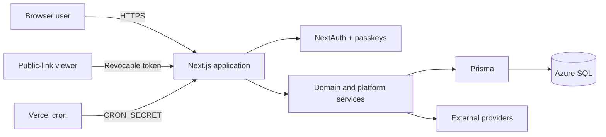

# Architecture overview

## Purpose

Orient maintainers to Nest as a product and technical system before they enter an individual module.

## Scope

Nest is a personal and shared-workspace finance application. It gives users visibility into real bank control balances, virtual envelope allocations, card payables, receivables, investments, rewards, and budget plans.

It is explicitly not:

- A bank, payment processor, or bank-feed aggregator.
- A general double-entry accounting system.
- An investment adviser.
- An autonomous financial agent.

## Business goals and target users

Goals evidenced by `README.md`, `guide.md`, and the feature code:

- Explain where cash is held and what each portion is intended for.
- Keep card liabilities, settlement reserves, and reimbursements visible together.
- Support personal and household collaboration without crossing workspace boundaries.
- Preserve an auditable, idempotent history for financial mutations.
- Provide read-only, grounded AI assistance over a user's own active workspace.

Target users are individuals and invited collaborators managing finances in one or more workspaces. Market segment, pricing, jurisdiction, and commercial business model are **Unknown from source code.**

## Main features

| Capability | User outcome | Primary implementation |
| --- | --- | --- |
| Workspaces and roles | Separate personal/shared financial scopes | `lib/workspace-auth.ts`, workspace APIs |
| Bank control accounts | Track current real-bank balances | `FinancialAccount`, accounts API |
| Envelope budgets | Allocate cash to purposes | `BudgetEnvelope`, transaction posting |
| Monthly planning | Balance sources and items, then fund destinations | `MonthlyBudgetPlan*`, budget-plan domain |
| Transactions and transfers | Record cash-flow and purpose reallocation | transaction APIs, posting service |
| Credit cards | Track statement activity, due dates, accounting, and payment | card and credit-transaction modules |
| Receivables | Track and settle expected repayment | receivable APIs and posting |
| Investments | Store dated invested/current value snapshots | investment module |
| Rewards | Track miles, hotel points, card points, and conversions | rewards module |
| Gmail card alerts | Import supported card alerts through OAuth | Gmail integration and SQL-backed jobs |
| Notifications | In-app, push, and email payment reminders | notification and job services |
| Ask Nest | Answer read-only grounded finance questions | `lib/ai/` |
| Nest CIO | Deterministic household allocation, liquidity, policy, and retirement planning | `lib/domains/cio/`, CIO page/API |
| Public sharing | Share minimal net-worth or card-due projections | revocable token endpoints |
| Administration | Inspect users, storage, jobs, AI usage, and sanitized health | admin page and services |
| PWA shell | Installability and static-only offline shell | manifest, service worker, offline assets |

## High-level architecture



See [system.mmd](../diagrams/system.mmd) and [system design](system-design.md).

## Technology stack

| Layer | Technology | Role |
| --- | --- | --- |
| Runtime | Node.js 22.13+ | Server execution and tooling |
| Framework | Next.js 16 App Router | Pages, server components, route handlers, proxy |
| UI | React 19, TypeScript, Tailwind CSS 4 | Interactive browser application |
| Client data | TanStack React Query 5 | Fetching, mutation, scoped invalidation |
| Validation | Zod 4 | Request and model-response validation |
| Authentication | NextAuth 4, OAuth providers, SimpleWebAuthn | Cookie session, social sign-in, passkeys |
| Persistence | Prisma 6, SQL Server provider | ORM and migrations |
| Production database | Azure SQL | Durable tenant and job state |
| AI | OpenAI SDK against Azure OpenAI v1 Responses API | Read-only finance assistant and Smart Review |
| Search | Azure AI Search | Optional gated workspace knowledge retrieval |
| Integrations | Gmail, Massive, SerpApi, Azure Communication Email, Web Push | Alerts, market/news context, notifications |
| API discovery | Generated OpenAPI and Swagger UI | Authenticated developer reference |
| Delivery | Vercel configuration and GitHub Actions | Runtime schedules and CI gates |

## Runtime architecture

- The browser renders React client components inside shared App Router layouts.
- Canonical application URLs include `/w/{workspaceId}`.
- `proxy.ts` extracts the URL workspace, adds request headers, rejects cross-origin unsafe API requests, and sets security headers.
- Page and route code resolve sessions through NextAuth and Azure SQL readiness recovery.
- API routes verify membership and minimum role on every workspace-scoped operation.
- Money-changing routes use SQL transactions, posting groups, and idempotency keys.
- Long-running or provider-facing work is represented by leased `BackgroundJob` rows.
- Responses containing private data are no-store and vary by cookie.

## Build and release process

```text
npm ci
→ Prisma client generation
→ UI architecture checks
→ ESLint
→ TypeScript
→ OpenAPI drift check
→ Node tests
→ production Next.js build
→ public artifact/dependency audit
```

GitHub Actions also runs CodeQL, Gitleaks, dependency review, and an ephemeral SQL Server baseline/integrity job.

## Deployment strategy

`vercel.json`, Vercel Analytics, and Vercel Speed Insights establish Vercel as the documented application and scheduler target. Azure SQL and external providers remain separately managed services. There is no checked-in infrastructure-as-code for either Vercel or Azure resources. See [deployment architecture](deployment.md).

## External dependencies

| System | Required? | Failure effect |
| --- | --- | --- |
| Azure SQL / SQL Server | Required | Authentication and application data fail closed; transient serverless wake is retried |
| NextAuth provider or passkey | At least one sign-in path needed | New authentication fails; existing session behavior depends on DB |
| Azure OpenAI | Optional feature | Ask Nest/AI review returns a controlled unavailable/configuration error |
| Gmail API | Optional | Gmail connection/sync unavailable; manual finance remains |
| Azure Communication Email | Optional | Email reminder channel unavailable |
| Web Push | Optional | Push channel unavailable; in-app notifications remain |
| Azure AI Search | Optional and double-gated | Unstructured workspace retrieval disabled |
| Massive | Optional | Market-history tool unavailable |
| SerpApi | Optional | News search unavailable |

## Security model

- Identity: NextAuth JWT cookies backed by server-validated `LoginSession` rows.
- Authorization: OWNER > EDITOR > VIEWER, verified against `WorkspaceMember`.
- Isolation: canonical workspace URL plus membership-checked, workspace-scoped database queries.
- Mutation defense: same-origin checks, body limits, Zod validation, role gates, rate limits, request IDs.
- Financial integrity: integer cents, SQL transactions, posting journal, idempotency, reversals rather than deletion.
- Secret protection: server-only environment variables; Gmail credentials use versioned AES-256-GCM with contextual AAD.
- Card-data minimization: only card metadata and last four digits are retained.
- Public access: random revocable bearer tokens with minimal projections and no-store responses.
- Browser defense: nonce CSP, HSTS in production, frame denial, restrictive permissions policy, static-only service-worker cache.

See [security architecture](security.md).

## Related Files

- [`README.md`](../../README.md)
- [`guide.md`](../../guide.md)
- [`package.json`](../../package.json)
- [`proxy.ts`](../../proxy.ts)
- [`prisma/schema.prisma`](../../prisma/schema.prisma)
- [System design](system-design.md)
- [ADR-007: Read-only CIO decision support](adr/ADR-007-read-only-cio-decision-support.md)

## Dependencies

- All application modules.
- Azure SQL and configured identity providers.

## Assumptions

- The repository describes version `0.1.x`.
- “Production” refers to the environment validated by `lib/production-config.ts`.

## Known Limitations

- No formal SLA/SLO, data-classification policy, or capacity plan is checked in.
- Deployment topology outside the Next.js application is only partially represented.

## Future Improvements

- Add infrastructure-as-code and environment topology.
- Add product requirement identifiers to the traceability matrix.
- Define SLOs and ownership per module.

## Last Updated

2026-07-30
