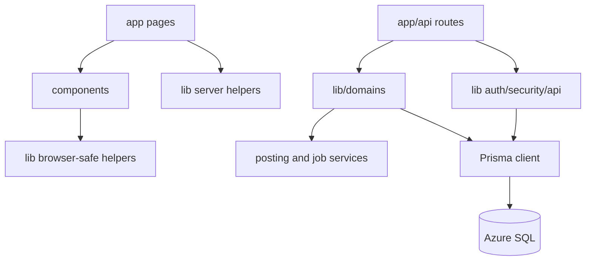

# Repository structure

## Purpose

Explain where code belongs and which dependency directions preserve the current architecture.

## Scope

The application is one private npm package. There are no workspaces or separately published packages.

## Directory map

| Path | Responsibility | Why it exists | Dependency notes |
| --- | --- | --- | --- |
| `app/` | Next.js App Router pages, layouts, route states, and HTTP route handlers | Makes routing and server/client boundaries filesystem-driven | May depend on `components/` and `lib/`; route handlers should delegate reusable logic |
| `app/api/` | Cookie-authenticated JSON APIs, public token APIs, OAuth callbacks, cron entry points | Defines the HTTP boundary | Depends on guards, domain services, Prisma, and validation |
| `app/w/[workspaceId]/` | Canonical workspace-scoped page URLs | Keeps workspace selection tab-local and explicit | Proxy copies the path workspace into request headers |
| `app/styles/` and `app/globals.css` | Ordered CSS layers | Preserves tokens, feature compatibility, components, and responsive utilities | UI contract tests guard layer order and complexity |
| `components/` | React page controllers, shell, feature views, dialogs, and shared client behavior | Separates presentation and interaction from route entry points | Client components use typed fetch helpers and React Query |
| `components/ui/` | Shared buttons, controls, dialogs, form, page/query/route-state primitives | Centralizes accessibility and behavior contracts | Feature code should use these instead of raw controls |
| `components/skeletons/` | Route-specific loading geometry | Prevents layout shifts and maintains predictable loading states | Imported from `loading.tsx` files and feature boundaries |
| `lib/` | Server services, cross-cutting utilities, auth, posting, jobs, integration clients, shared client helpers | Keeps reusable logic outside filesystem routes | Must respect server-only versus browser-safe imports |
| `lib/domains/` | Extracted domain services and contracts | Reduces route-handler and controller coupling incrementally | Domain code may depend on Prisma and cross-cutting `lib` services |
| `lib/domains/cio/` | Deterministic household planning snapshot and engines | Keeps allocation, flow, policy, quality, and projection logic shared by UI and AI | Prisma reads stay in the repository/service boundary; pure engines remain browser-independent |
| `lib/ai/` | Ask Nest, Smart Review, deterministic classification, and external retrieval | Isolates model prompts/tools and evaluation-sensitive logic | Financial tools are read-only and workspace-scoped |
| `lib/api/` | Shared API envelopes, client errors, pagination, SQL batching | Defines cross-route transport conventions | Used by routes and client controllers |
| `lib/observability/` | Query duration and row-count telemetry | Measures expensive dashboard/context reads without caching them | Emits structured logs/performance observations |
| `prisma/` | Current schema, baseline, migrations, and seed | Defines persistence and upgrade history | SQL Server-specific constraints live in migrations |
| `prisma/baseline/` | Manifest and SQL for bootstrapping an empty database | Avoids replaying historical migrations onto a new database | `scripts/bootstrap-database.mjs` is the supported entry point |
| `tests/` | Node contract and SQL Server integration tests | Protects architecture, security, ledger, UI, and provider boundaries | Many tests inspect source contracts as well as execute functions |
| `evals/ask-nest/` | Checked-in AI routing/retrieval golden cases | Prevents prompt/model changes from silently changing routing | Run with `npm run ai:eval` |
| `scripts/` | Safe database operations, generation, audits, metrics, and legacy tools | Keeps operational work explicit and reviewable | Live data scripts must be dry-run first and gated |
| `generated/` | Generated OpenAPI artifact | Provides a deterministic route inventory | Regenerate; do not hand-edit |
| `public/` | Service worker, theme bootstrap, PWA assets, offline page, and bank logos | Serves runtime-string and static assets | Some files appear unused to import-graph tools but are runtime entry points |
| `types/` | TypeScript declaration augmentations | Extends framework/library types not owned by application modules | Keep declarations narrow |
| `docs/` | Living engineering knowledge base | Preserves architectural and business context | Not a substitute for executable contracts |
| `.github/` | CI, CodeQL, dependency review, secret scanning, ownership, and PR template | Enforces repository policy on GitHub | Main-branch and pull-request gates |
| `.vscode/` | Optional editor task | Provides a local convenience only | Not a runtime dependency |

## Important root files

| File | Responsibility | Maintenance hazard |
| --- | --- | --- |
| `package.json` | Runtime dependencies and executable workflows | Script names are referenced by CI and docs |
| `.env.example` | Supported configuration surface without secret values | New configuration must be documented and classified server/public |
| `next.config.ts` | Redirects, images, and Turbopack root | Redirect changes can bypass canonical workspace navigation |
| `proxy.ts` | Workspace header propagation, same-origin checks, CSP, and security headers | This is a critical request boundary |
| `instrumentation.ts` | Production configuration validation at startup | Weakening checks can make insecure deployment appear healthy |
| `vercel.json` | Scheduled route definitions | Schedules are UTC and routes require `CRON_SECRET` |
| `eslint.config.mjs` | Static quality and UI boundary rules | Shared UI constraints depend on these checks |
| `postcss.config.mjs` | Tailwind/PostCSS processing | Tailwind v4 does not use a conventional project config here |
| `tsconfig.json` | Strict TypeScript and `@/*` alias | Server/client import mistakes still require production build validation |
| `README.md` | Public repository introduction | Deep engineering detail belongs in `docs/` |
| `guide.md` | User-facing financial mental model | Business-rule changes must remain consistent with implementation |

## Naming conventions

- React components and their files use `kebab-case.tsx`; exported component names use PascalCase.
- Next.js route files use framework names: `page.tsx`, `layout.tsx`, `route.ts`, `loading.tsx`, `error.tsx`, and `not-found.tsx`.
- Library files use lower-case kebab case.
- Prisma models use singular PascalCase; fields use camelCase.
- Database state values are uppercase strings such as `ACTIVE`, `DRAFT`, `POSTED`, and `DEAD_LETTER`.
- Money fields end in `Cents` and use integers unless the domain is points/miles or an explicit decimal rate.
- Workspace-owned rows normally carry `workspaceId` and are queried with that scope.
- Tests use `*.test.mjs`; SQL-requiring suites use `*.integration.test.mjs`.

## Dependency direction

Rules:

- Do not import server credentials, Prisma, or Node-only crypto into client components.
- Do not place reusable financial logic only inside a route handler.
- Do not let the model-facing AI layer mutate finance data.
- Do not read a workspace solely from a client-controlled payload without verifying membership.
- Avoid cross-domain barrel exports that hide dependencies; current `lib/domains/*/index.ts` files expose deliberate domain surfaces.

## Related Files

- [System design](system-design.md)
- [Module index](../modules/README.md)
- [Coding conventions](../ai/coding-conventions.md)
- [`tsconfig.json`](../../tsconfig.json)

## Dependencies

- Next.js App Router conventions.
- TypeScript path alias `@/*`.
- Prisma schema and SQL migrations.

## Assumptions

- A “module” in this knowledge base means a cohesive domain or platform area, not an npm package.

## Known Limitations

- Several page controllers and AI service files are very large and do not yet match the intended boundaries.
- File ownership is repository-wide through `.github/CODEOWNERS`; domain-specific owners are unknown from source code.

## Future Improvements

- Extract more route orchestration into `lib/domains/`.
- Add server-only import guards.
- Add domain-specific CODEOWNERS when ownership is established.

## Last Updated

2026-07-28
