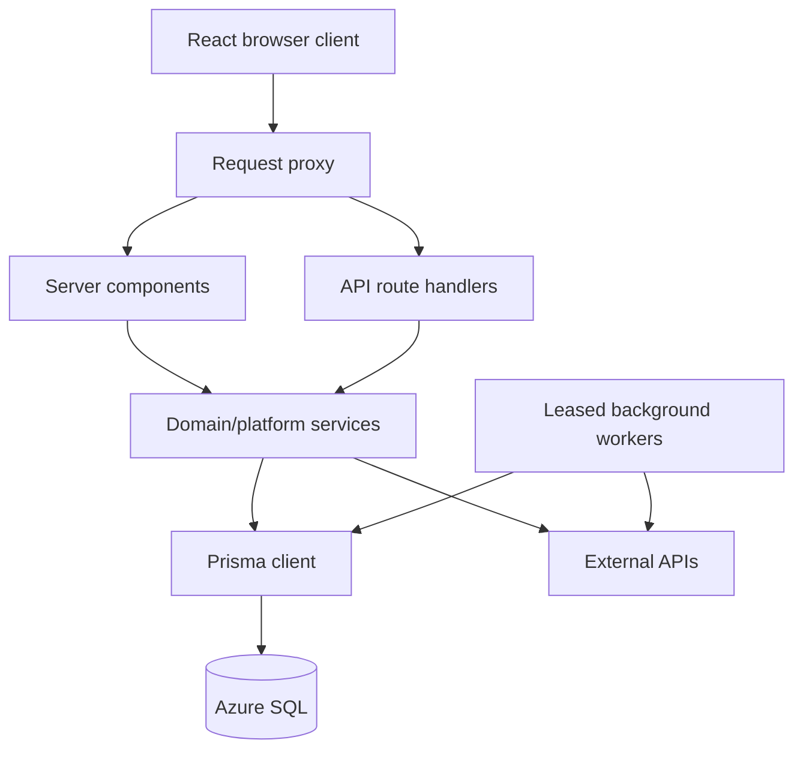

# System design

## Purpose

Explain how Nest's runtime parts collaborate and identify boundaries that safe refactors must preserve.

## Scope

This page covers runtime containers and cross-cutting design. Domain-specific details live in [module documentation](../modules/README.md).

## Runtime containers

Reusable source: [runtime-containers.mmd](../diagrams/runtime-containers.mmd).

## Request lifecycle

1. The browser loads a public path or canonical `/w/{workspaceId}/...` path.
2. `proxy.ts` creates a CSP nonce and attaches security headers.
3. Workspace paths become `X-Workspace-Id` and `X-Workspace-Path` request headers.
4. Server pages call `requireSession`; APIs call explicit session/workspace guards.
5. `workspaceFetch` copies the active URL workspace into API requests.
6. Routes validate query/body bounds and authorization.
7. Reads query workspace-scoped Prisma models; important aggregate reads emit telemetry.
8. Mutations execute inside domain services or a Prisma transaction. Money changes go through posting/idempotency.
9. Private responses use `Cache-Control: no-store`, `Vary: Cookie`, and `X-Request-Id` where the shared secure wrapper is used.
10. React Query invalidates or updates exact workspace keys.

## Server and client state

| State | Canonical owner | Notes |
| --- | --- | --- |
| Signed-in identity | NextAuth JWT plus `LoginSession` row | JWT is rejected when session row/version is invalid |
| Active tab workspace | `/w/{workspaceId}` URL | Primary request scope |
| Last-used workspace | cookie and `User.activeWorkspaceId` | Fallback for bare/legacy entry only |
| Finance data | Azure SQL | Never treat client cache as authoritative |
| Client query cache | React Query | Keys include workspace; removed on workspace change |
| Setup-guide progress | browser storage per workspace plus server context requirements | Required steps resume if underlying setup is removed |
| Background progress | `BackgroundJob` | Pollable, leased, resumable |
| Static offline shell | service-worker cache | No private API responses or queued mutations |

## Domain boundaries

| Boundary | Responsibilities |
| --- | --- |
| Identity/session | Provider sign-in, passkey handoff, session admission/revocation, recent auth |
| Workspace | Membership, roles, invitations, canonical routing, context |
| Ledger | Transactions, transfers, budget deltas, posting journal, reversals, reconciliation |
| Budget planning | Template sources/items, monthly drafts, balancing, confirmation posting |
| Cards | Card metadata, statement transactions, allocation, payment, reminders, alert staging |
| Receivables | Expected repayments, source references, close/settlement posting |
| Assets/rewards | Investment snapshots, miles, points, conversions |
| AI | Intent routing, read-only tools, grounded response, history/memory/usage |
| Integrations | Gmail OAuth/sync, Maybank imports, market/news/search providers |
| Jobs/notifications | Durable leases, retry/dead-letter, email/push/in-app dedupe |
| Administration/public | Fail-closed admin access, sanitized operations, minimal token views |

## Financial consistency model

Nest separates:

- `FinancialAccount.startingCents`: manually maintained real-bank control balance.
- `BudgetEnvelope.availableCents`: virtual allocation balance.
- `Transaction`: visible ledger movement.
- `PostingGroup`: auditable business operation joining related movements.
- `IdempotencyRecord`: replay-safe request claim and stored result.

This design allows a card purchase to move money between virtual purposes while bank cash remains unchanged until the real bank posts a payment.

## Error handling

- Input errors: Zod failures or explicit bounds produce 400/413/415/422-style responses depending on route boundary.
- Authentication: 401; workspace membership/role failures: 403.
- Optimistic/idempotency conflict: 409.
- Distributed rate limit: 429 with retry metadata.
- SQL serverless wake/unavailable: bounded recovery, then sanitized 503.
- Provider failures: mapped to stable, redacted feature errors; secrets and raw provider responses are not returned.
- Background failures: sanitized code/message, bounded retry, then `DEAD_LETTER`.
- Client mutations: `ApiClientError` preserves status, code, request ID, issues, and `Retry-After`.

Routes written before the shared secure wrapper do not all emit identical envelopes. See [API conventions](../api/README.md).

## Concurrency

- SQL transactions use locking/unique constraints for session admission and financial claims.
- Posting uses workspace/operation/idempotency uniqueness.
- Card allocation and receivable settlement use conditional single-row claims.
- Background jobs use lease tokens and expiry; stale workers cannot complete work they no longer own.
- Provider throttles and caches are database-backed where cross-instance coordination is required.

## Extension points

- New finance mutation: add a domain operation and posting group, never an isolated balance write.
- New workspace domain: add `workspaceId`, guard every route, index dominant scoped queries.
- New integration: encrypt credentials, bind OAuth state, enforce limits, isolate provider payloads, and use jobs for long work.
- New AI tool: read-only, bounded, deterministic where possible, evidence-producing, and included in the golden evaluation.
- New public view: random revocable token, minimal projection, no-store, audit, and distributed rate limiting.

## Related Files

- [`proxy.ts`](../../proxy.ts)
- [`lib/workspace-auth.ts`](../../lib/workspace-auth.ts)
- [`lib/posting-service.ts`](../../lib/posting-service.ts)
- [`lib/background-jobs.ts`](../../lib/background-jobs.ts)
- [Data flow](data-flow.md)

## Dependencies

- Next.js request lifecycle.
- React Query cache semantics.
- Prisma transaction and SQL Server constraint semantics.

## Assumptions

- Server functions may execute on multiple instances, so process memory is not a correctness boundary.

## Known Limitations

- Some older routes duplicate validation/error mapping instead of using `runSecureApiRoute`.
- Domain extraction is incomplete; several page controllers and routes remain large.

## Future Improvements

- Standardize all APIs on shared validation and error envelopes.
- Split large feature controllers into stateful orchestration plus focused views.
- Add explicit module dependency enforcement.

## Last Updated

2026-07-28
