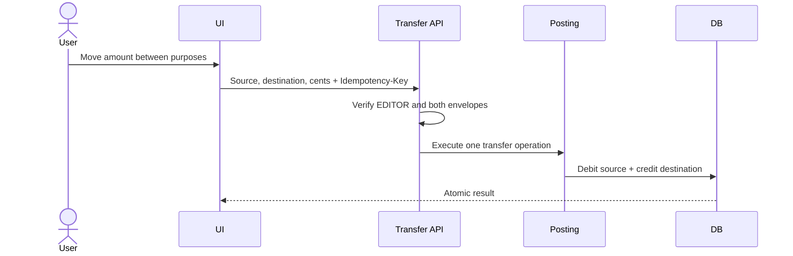

# Business workflows

## Purpose

Connect user intent to APIs, posting effects, persistence, and maintenance risks.

## Scope

These flows summarize current behavior. Exact payloads are in [API documentation](../api/README.md).

## New user and workspace setup

1. User signs in with a verified OAuth provider or passkey.
2. Auth ensures a user and default workspace exist.
3. Canonical entry redirects to `/w/{workspaceId}`.
4. Setup guide requires a bank account, then a sub-account; a card is optional.
5. Mutations refresh workspace context and feature queries.

Failure risks: database wake, pending session limit, no membership, or underprivileged VIEWER. Setup progress is advisory; missing required records reopen the guide.

## Direct bank expense

1. User chooses bank account and envelope.
2. UI sends `POST /api/transactions` with an idempotency key.
3. Route verifies EDITOR and account/envelope scope.
4. Posting creates debit transaction and reduces envelope availability.
5. User updates bank control balance when the real withdrawal posts.

The final manual step is intentional; see [BR-012–BR-015](business-rules.md).

## Envelope transfer

Same-bank transfer does not change real-bank control. Cross-bank transfer must also occur at the banks and both control totals must be refreshed.

## Monthly budget

1. Maintain reusable source and item templates.
2. Start a specific month from setup or blank.
3. Adjust source owners/amounts and item destinations/amounts.
4. Confirmation validates non-empty equal totals.
5. One posting applies each item's remaining cents to its destination.
6. Plan becomes confirmed/read-only.
7. User updates bank control balances when income actually arrives.

Failures: unbalanced plan, missing member/destination, already-confirmed plan, idempotency conflict, or concurrent claim.

## Personal credit-card purchase

1. Record/import card transaction; statement payable increases.
2. Account using “Deduct.”
3. Debit the spending envelope.
4. Optionally credit default/card-settlement envelope.
5. Mark card transaction allocated/accounted.
6. Pay selected statement later: debit settlement envelope and add negative card payment.
7. Update bank control after real payment posts.

The posting journal makes allocation/payment retry-safe.

## Reimbursable card purchase and receivable settlement

1. Record card purchase.
2. Account using “Create Receivable”; payable and expected recovery both remain visible.
3. When payment arrives, close the receivable.
4. Close credits the workspace default settlement destination and optionally debits recorded source.
5. Update real-bank control for received cash.
6. Pay card statement through normal payment workflow.

If only part is received, edit or split before Close; current Close settles full amount.

## Gmail alert synchronization

Source: [gmail-job-sequence.mmd](../diagrams/gmail-job-sequence.mmd).

1. OWNER with recent auth starts PKCE Gmail consent.
2. Callback consumes hashed state and stores encrypted grants.
3. Manual or scheduled route enqueues scoped `GMAIL_SYNC`.
4. Worker claims a lease and reads bounded history/query page.
5. Metadata filters irrelevant subjects before body fetch.
6. Parser/dedupe stages normalized alerts/card transactions.
7. Checkpoint continues later or stores the final history cursor.
8. User reviews/account transactions.

## Card reminder delivery

1. Daily cron selects outstanding statement obligations in reminder window.
2. System derives stable daily dedupe/delivery identity.
3. In-app notification is upserted.
4. Email/push delivery runs through reliable jobs and caps.
5. Stale push endpoints are deleted; sanitized partial failure is retained.
6. Once statement is no longer outstanding, reminders stop.

## Investment update

1. Create investment account with inception/liquidity metadata.
2. Add dated snapshot of cumulative invested/current cents.
3. Latest deterministic snapshot drives value/gain/return/liquid totals.
4. A contribution/withdrawal requires separate bank/envelope recording.

## Ask Nest answer

1. User asks a bounded question in an active workspace.
2. Deterministic intent hint selects read-tool families.
3. Azure OpenAI requests bounded, scoped tools.
4. Tools return structured output and evidence.
5. Final structured response is validated; displayed money must be grounded in tool values.
6. Turn/usage/quality telemetry persists.
7. User may explicitly approve safe memory or submit feedback.

Failures produce a controlled explanation; no finance state is mutated.

## Workspace invitation

1. OWNER invites email with VIEWER/EDITOR role.
2. Raw one-time token is emailed; only hash is stored.
3. Authenticated recipient inspects invitation.
4. Recipient explicitly accepts or declines before expiry.
5. Acceptance creates/updates membership and audits action.
6. Sender can revoke pending invitation.

## Public share

1. OWNER with required protections enables link.
2. System stores random token and audits creation.
3. Public GET uses token to return minimal net-worth/card-due projection.
4. Response is no-store and rate-limited.
5. Owner deletes link to revoke immediately.

## Related Files

- [Business rules](business-rules.md)
- [API index](../api/README.md)
- [Module index](../modules/README.md)
- [Testing strategy](../testing/strategy.md)

## Dependencies

- Workspace roles, posting service, SQL jobs, and configured providers.

## Assumptions

- User keeps real-bank control balances current.

## Known Limitations

- No automated bank feed closes the real-cash side.
- Browser-level screenshots and UX walkthroughs are not checked in.

## Future Improvements

- Add workflow-specific acceptance tests and incident recovery steps.

## Last Updated

2026-07-28
