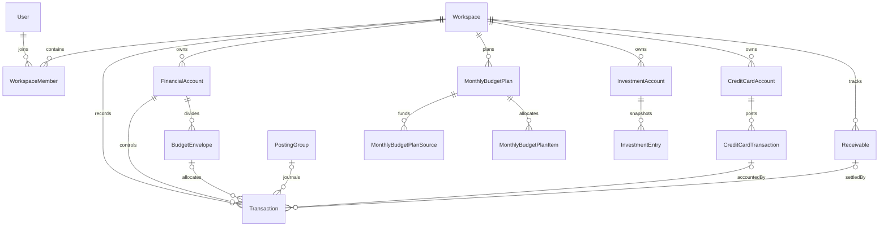

# Entity relationship diagram

## Purpose

Show the relationships most relevant to tenant isolation and financial posting.

## Scope

The complete 61-model graph is too dense for one useful diagram. This view intentionally focuses on core domains; [schema.md](schema.md) catalogs every model.

Reusable source: [er.mmd](../diagrams/er.mmd).

## Relationship rules

- Workspace-owned child IDs are never sufficient authorization on their own.
- Account and envelope referenced together must belong to the same workspace and parent relationship.
- Cross-workspace receivable source IDs are intentionally application-validated rather than local composite foreign keys.
- `PostingGroup` is the operation-level parent for related transactions and receivables.
- SQL `NO ACTION` is used where cascade paths would conflict; Prisma/services order cleanup.
- Polymorphic `LegacyRecordLink.targetModel/targetId` cannot have a conventional foreign key.

## Related Files

- [`prisma/schema.prisma`](../../prisma/schema.prisma)
- [Schema catalog](schema.md)
- [Posting ADR](../architecture/adr/ADR-002-posting-ledger.md)

## Dependencies

- Prisma relations and SQL migration constraints.

## Assumptions

- Diagram labels express business roles, not every physical foreign key.

## Known Limitations

- Auth, AI, rewards, notification, cache, and job relations are omitted from the visual for readability.

## Future Improvements

- Generate per-domain ER diagrams from Prisma metadata.

## Last Updated

2026-07-28
